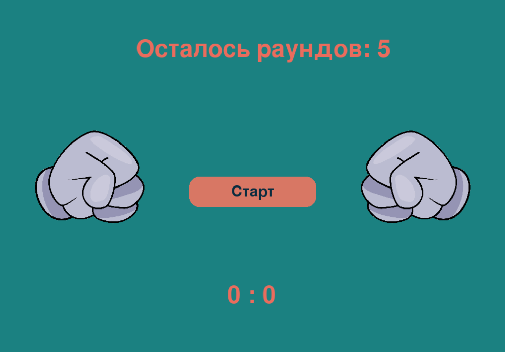
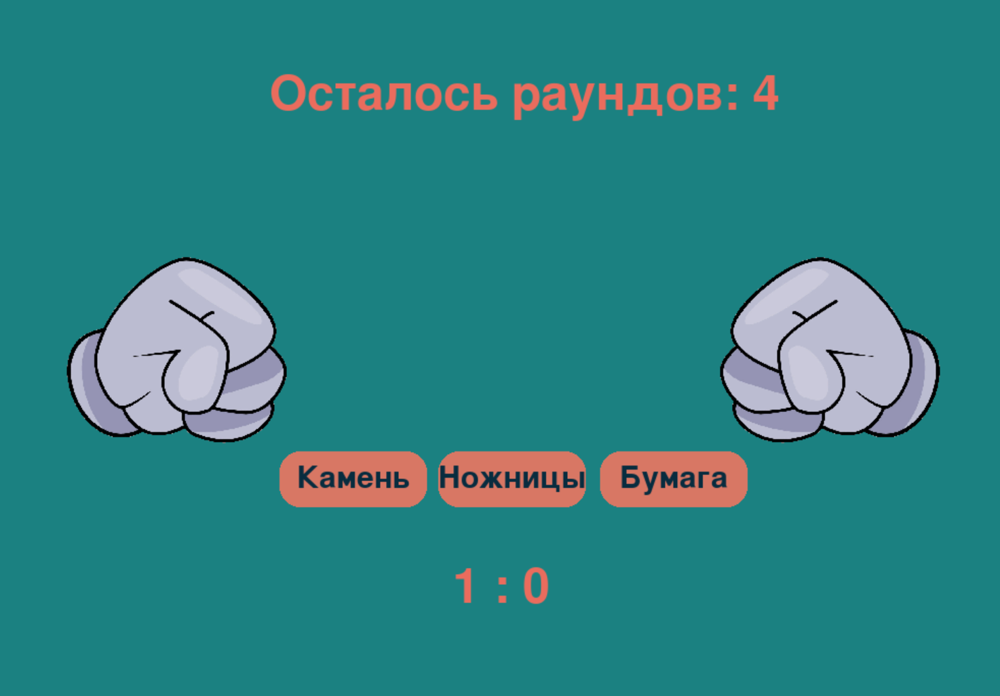

<h1 align="center">Rock, Paper, Scissors</h1>

A simple "Rock, Paper, Scissors" game built with Python using the PyGame engine.

## 🎮 Game Description

A classic "Rock, Paper, Scissors" game with a graphical interface. The player chooses one of three options, then the computer makes a random selection. The result is determined by standard rules:
- Rock beats scissors
- Scissors beat paper
- Paper beats rock

## 📋 Requirements

- Python 3.7 or higher
- Libraries listed in `requirements.txt`

## 🚀 Installation and Launch

1. **Clone the repository or download the project files**

2. **Install required dependencies:**
```bash
pip install -r requirements.txt
```

3. **Launch the game:**
```bash
python main.py
```

## 📦 Dependencies

Main dependencies are listed in the `requirements.txt` file:
- `pygame==2.6.1` - game engine
- `colorama==0.4.6` - colored console output
- `icecream==2.1.4` - debugging
- `asttokens==3.0.0` - AST manipulation
- `executing==2.1.0` - code execution
- `Pygments==2.19.1` - syntax highlighting

## 🎯 Controls

- **Mouse**: Selecting options (Rock, Paper, Scissors)
- **ESC**: Exit the game

## 🎨 Features

- Colorful graphical interface
- Sound effects
- Score tracking
- Choice animations
- Simple and intuitive controls

## 🔧 Configuration

Game settings can be modified in the configuration files located in the `config/` folder.

---

<p align="center">
  
  
</p>

**Good luck and have fun!**

